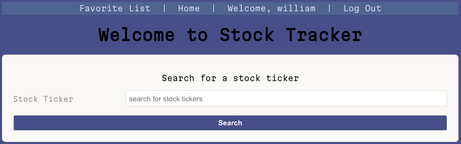
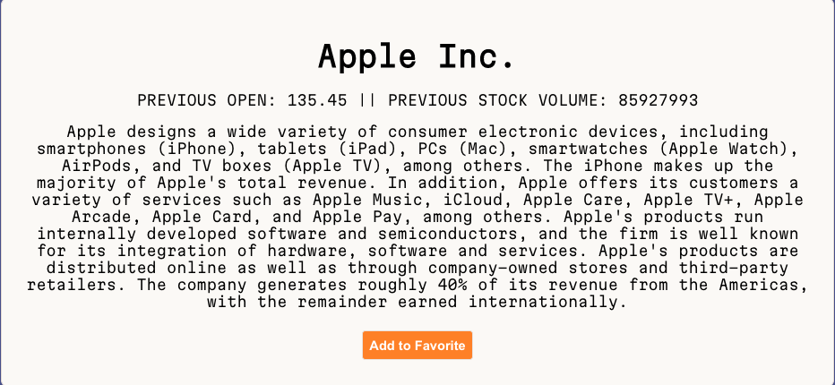

# STOCK TRACKER

### *Created by Will* 

 
Stock tracker is a free webiste that allows the users to track and follow stocks by providing a stock ticker 

## Screenshots:

 

## Technologies Used: 

## Getting Started: 
- **[Stock Tracker Link](https://stock-tracker.herokuapp.com)**

- **[Trello Board](https://trello.com/b/pHRa5ZOC/stock-tracker)**

## Future Enhancements 
- allow more information to be queried for (RSI, Greek for options, earnings estimate)
- allow user to calculate monthly/ quarter averages. 
- Implement a light/dark mode

